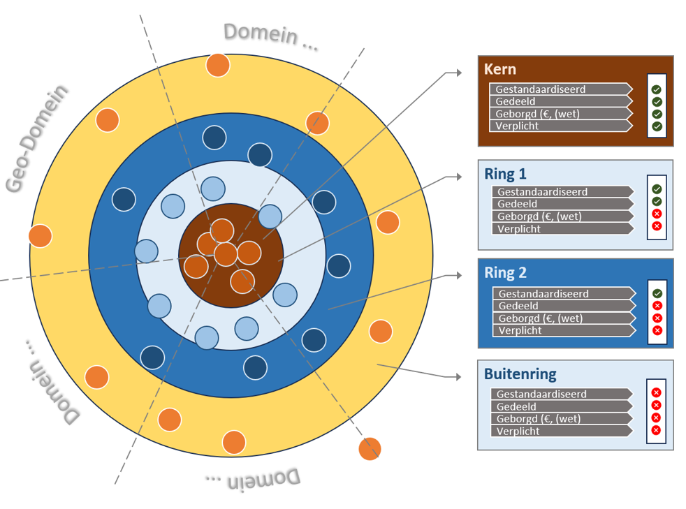
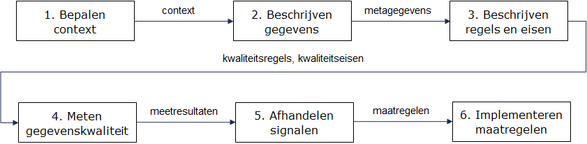

# Een semantische kluwen
Voor het begrippen 'dataset' en 'databron' grijpen we terug op de definitie van data.overheid.nl:

**Dataset:** een beschrijving van een verzameling van data van een data-eigenaar. Dit kan bijvoorbeeld één tabel met data zijn of een verzameling van tabellen met samenhangende data, bijvoorbeeld alle tabellen per jaar over de periode 2005-2016.  
**Databron:** een verwijzing naar de daadwerkelijke vindplaats van data die in de dataset wordt benoemd. 

In de GDI wordt gesproken over 'bronnen ' en 'registraties': een **bron** is “een registratie die is aangewezen als de plaats waarin gegevens worden beheerd.” Een **registratie** wordt in de GDI gedefinieerd als “een gegevensverzameling waarin gegevens worden vastgelegd."

Dit is een semantische kluwen. Vandaar dat gegevens, data, datasets, bronnen en databronnen in het kader van Zicht op Nederland moeten worden geduid.

Dit geldt in mindere mate voor het begrip 'metadata'. 

## 'Gegevens', 'data', 'datasets' en '(data-)bronnen' in de context van DSFL

Om meteen met de deur in huis te vallen:
> De termen **gegevens** en **data** worden in deze Doelarchitectuur gebruikt als synoniem en mogen dus door elkaar gebruikt worden.

> De term **dataset** wordt gebruikt voor een bundeling van data, ongeacht over welke as deze bindeling plaatsvindt.

> De termen **bron** en **databron** (en gevoeglijk ook **gegevensbron**) worden gebruikt voor de aanwijzing van de plaats waar data wordt geregistreerd (vastgelegd) en beheerd.

> Zicht op Nederland, en daarmee de scope van DSFL, is gericht op het delen van data in een ruimtelijke ('geo-')context.

## Welke data zijn in scope van DSFL?

De scope van de data 'in' DSFL is beschreven in het beleidsplan Zicht op Nederland en de Tweede Kamerbrief van de Minister van VRO uit februari 2024:

> Voor de DSFL zijn alle data in scope die nodig zijn voor het integraal beantwoorden voor maatschappelijke opgaven in de fysieke leefomgeving (en de ruimtelijke ordening).

Veel data in DSFL zal geografische data zijn, maar dat hoeft niet. Voor bepaalde maatschappelijke opgaven kan het nodig zijn om data die niet per se geografisch is opgeslagen (zoals projectmetingen) toch af te beelden op geografische ondergronden.

Om deze combinatie van geografische en niet-geografische data mogelijk te maken bevat DSFL een aantal hulpcomponenten. Zie hiervoor het hoofdstuk Componenten.

In DSFL worden niet alleen de klassieke data uitgewisseld. In het kader van datagedreven werken zijn er ook meer en meer informatie-producten die binnen de datawaardeketen uitgewisseld worden. 

> Onder gegevens of **data in het kader van DSFL** worden verstaan niet alleen klassieke data, maar ook daarvan afgeleide informatie-producten en andere digitale objecten (‘digital assets’ of ‘digital artefacts’).

Voorbeelden hiervan zijn algoritmen die door modellen en Digital Twins kunnen worden uitgewisseld, of interne parameters van AI-modellen. Het vinden en uitwisselen van deze digitale objecten kan leiden tot specifieke extra afspraken binnen DSFL. Denk hierbij bijvoorbeeld aan het inrichten van een 'App Store' waarin Digital Twins en relevante algoritmen kunnen worden gevonden (en 'gedownload'). 

DSFL is daarmee een heterogeen, dynamisch gegevenslandschap dat binnen de vastgestelde regels (zie Governance) kan groeien.

## Datafundament van Zicht op Nederland: een dynamisch ringenmodel 

In het kader van Zicht op Nederland zijn de (geo-)Basisregistraties de belangrijkste bronnen voor het leveren van basis datasets.

Naast de basisregistraties bestaan er diverse andere – vaak domein specifieke - datasets bij een veelheid van databronnen. Sommige datasets zijn inhoudelijk aanvullend op die in de basisregistraties, andere overlappen deels hiermee. De kwaliteit (juistheid, volledigheid, actualiteit) is variabel. Ook de mate van toegankelijkheid en bruikbaarheid varieert: sommige datasets zijn publiek beschikbaar en gestandaardiseerd, andere niet. Daarnaast verschilt de governance: is beheer duurzaam geregeld en gefinancierd.

Op basis van deze kenmerken classificeren we datasets in een ringenmodel: 
- Buitenring: datasets die niet landelijk gestandaardiseerd of gedeeld zijn;
- Ring 2: datasets die wél gestandaardiseerd zijn, maar alleen binnen het oorspronkelijke doel worden gebruikt. Er is geen garantie op beschikbaarheid of actualisatie, zeker bij projectmatige datasets;
- Ring 1: gestandaardiseerd, gedeeld en financieel geborgd. Dit zijn duurzame geo-datasets zonder wettelijke grondslag, maar met breed gebruik en langdurig beheer;
- Kern ('Ring 0'): de basisregistraties. Deze zijn juridisch, organisatorisch en financieel geborgd. Er geldt een wettelijke verplichting tot het maken, gebruiken en terugmelden van gegevens.

Daarnaast zijn er datasets waarvan het bestaan niet publiek bekend is – deze bevinden zich “buiten de buitenring”. 

Het ringenmodel toont daarmee schematisch een data-ecosysteem in zijn geheel (zie figuur).

<figure></img><figcaption>Classificatie van databronnen in Ringmodel.<i></i></figcaption></figure>

> DSFL gebruikt het ringenmodel om datasets en/of -bronnen te classificeren op basis van toegepaste standaardisatie, beschikbaarheid voor gebruik, duurzame borging en gebruiksplicht. Daarmee wordt bepaald op welke manier en in welke context een dataset bruikbaar is of kan worden binnen de DSFL.  

De ontwikkeling van DSFL richt zich primair op datasets uit de kern ('ring 0') en de ring 1 van het ringenmodel. Hierdoor heeft de DSFL maximale meerwaarde en kan deze meerwaarde snel worden gemunt. 

> De doelarchitectuur van DSFL richt zich a priori op de ontsluiting van datasets in de ringen 'kern' ('ring 0') en ring 1.

> Het ringenmodel (en daarmee DSFL) is dynamisch: datasets/-bronnen kunnen 'binnen de ringen' terecht komen door te voldoen aan een aantal technische, organisatorische en beheersmatige (governance-)eisen.

Hierdoor ontstaat een DSFL dat zich kan blijven aanpassen aan de maatschappelijke vraagstukken, één van de belangrijke eisen die aan het stelsel zijn gesteld.

## Afbakening van gegevens, bronnen en gebruik (Ine/Arno)

De huidige (geo-)Basisregistraties voeren de registraties van fysieke en virtuele objecten (volgens NEN3610) van de DSFL. Naast deze Basisregistraties bevat de DSFL allerlei gegevens over deze/gekoppeld aan gebieden, die niet alleen door de overheid maar ook door andere partijen kunnen worden geleverd en beheerd.

Voor de afbakening van de gegevens in DSFL geldt dat deze wordt gevormd door het gebruik, niet door het aanbod. Aangaande het gebruik staat in de kaders (geparafraseerd): 'data die nodig zijn voor het oplossen van de maatschappelijke opgaven'. Dat is een brede definitie, waarbij op voorhand geen keuze kan worden gemaakt tussen bijvoorbeeld open en gesloten data en data die van overheidspartijen afkomstig is of bijvoorbeeld van een commerciële partij.

> De volgende categoriën data maken onderdeel van de DSFL:
- open publieke data
- gesloten publieke data
- open data van derden
- gesloten data van derden

Er worden dus a priori geen bronnen uitgesloten. De categorisering in ringen (zie de vorige paragraaf) is echter wel van toepassing: deze bepaalt aan welke eisen een databron moet voldoen om als volwaardige partij in het stelsel te functioneren. Deze Doelarchitectuur beschrijft waar deze eisen over gaan.

Het gebruik van de data in DSFL heeft ten principale wel een afbakening, namelijk een doelbinding. Deze doelbinding bestaat wettelijk al lang, maar impliciet gebruikt. In de DSFL (of beter gezegd: in het principe van 'dataspaces' in het algemeen) wordt deze doelbinding echter expliciet gemaakt door middel van een contract bij het uitwisselen van de gegevens.

> Het delen van data binnen DSFL heeft een contractuele grondslag, zowel voor levering als gebruik.

Deze grondslag kan minimaal zijn, zoals in het geval van 'open data'. Het is wel een belangrijk beginsel, omdat hiermee principieel wordt geregeld dat gebruik van gegevens gebonden wordt aan een onderliggende afspraak - en daarmee de weg vrij maakt om gebruik van data te analyseren. Tevens worden hiermee patronen mogelijk zoals betalen voor bepaald gebruik of het controleren op doelbinding.

<>gratis vs betaalde data

Een kenmerk van een dataspace is dat deze rondom use cases wordt ingericht. In het geval van DSFL zijn dit de maatschappelijke vraagstukken. Hierbij worden alle stakeholders betrokken, zodat de vragende partijen ook in contact zijn met de aanbiedende partijen en vraag en aanbod op elkaar kunnen worden afgestemd. Dit heeft als consequentie dat niet alle data over de fysieke leefomgeving op voorhand in de dataspace fysieke leefomgeving beschikbaar moet worden gesteld. 

> Per maatschappelijke vraag/use case wordt bepaald welke data nodig is.

De 'basis-set' van beschikbare data wordt gevormd door de datasets in de kern ('ring 0') van het ringenmodel. Deze vallen onder de wet op de Basisregistraties. <>

Bij de term 'afbakening' hoort ook een set regels en een bepaalde Governance. De overheid speelt de rol van ‘primus inter pares': zij treedt in het data-ecosysteem op als ‘gewone’ speler. Daarbij speelt zij ook een andere rol spelen: als stelselverantwoordelijke. Zie hiervoor het hoofdstuk Governance.

## 'Metadata' in de context van DSFL

Een dataspace is een ecosysteem waarin aan de ene kant data- en serviceproviders en aan de andere kant potentiële consumenten/gebruikers samen worden gebracht. Aangezien in DSFL men niet per definitie 'op elkaar aangewezen is' voor een vastgesteld probleem of proces, dient een succesvolle 'matchmaking' plaats te vinden tussen vraag en aanbod. Er worden in feite relaties opgebouwd die leiden tot datadeling. Om matchmaking te faciliteren, zijn beschrijvingen vereist van de beschikbare gegevens: metadata van de data en diensten die worden aangeboden, inclusief informatie over de voorwaarden waaronder ze worden aangeboden. De consument/gebruiker kan zo de juiste gegevens voor de juiste vraag identificeren en wordt doorgeleid naar de aanbieder.

> DSFL bevat minimaal één metadata-catalogus voor het publiceren en terugvinden van informatie over de binnen DFSL bestaande datasets en diensten

Het publiceren van data in DSFL bestaat voor een dataprovider uit de volgende stappen:
- metadata vaststellen over o.a. kwaliteit, de link naar de dienst (URI), de API beschrijving, de gebruikervoorwaarden (creative commons kan als default worden genomen), de geografische component (werkingsgebied);9
- metadata formeren conform het NL profiel op ISO 19115. Deze ISO standaard is belangrijk in de Geo-wereld. In FDS is DCAT als standaard opgenomen;voorgeschreven, en wel specifiek het Nederlands profiel op DCAT (DCAT-AP-NL). Er zal een mapping nodig zijn op DCAT-AP-NL zodat metadata daarmee ook conform DCAT kan worden uitgeleverd
- metadata opslaan in een DSFL metadata-catalogus. 

In [DSSC Blueprint - Publication and Discovery](https://dssc.eu/space/BVE2/1071256989/Publication+and+Discovery) is meer informatie te vinden.

## De metadata in DSFL: van ruwe meetdata tot App Store

In de DSFL wordt een brede definitie gebruikt van het begrip 'data'. Een direct gevolg van deze brede definitie is dat ook metadata een breed assortiment aan digitale objecten en diensten kunnen beschrijven. 

> Per datasoort/digitaal object wordt in DSFL bepaald welke metadata worden vastgelegd.

Hierdoor ontstaan brede mogelijkheden voor het vinden en ontsluiten van digitale objecten in DSFL: van ruwe meetdata tot en met algoritmen. 

In Zicht op Nederland is een speciale plek ingeruimd voor Digital Twins. Op het gebied van Digital Twins openen zich mogelijkheden om parameters, configuraties, algoritmes of zelfs complete Digital Twins uit te wisselen in DSFL. In dat laatste geval, uitwisselen van algoritmen of complete applicaties, ontstaat daardoor een speciale incarnatie van de metadata-catalogus: deze noemen we een 'App Store'. Het ondersteunen van zo'n App Store is een expliciete eis aan DSFL vanwege de nauwe verbintenis met het gebruik van Digital Twins. Het is niet moeilijk om dit concept door te trekken naar andere 'slimme' afnemers (en aanbieders), zoals een App Store voor Geografische AI modellen. Zie voor de App Store het hoofdstuk 'Componenten'.

Geo-specifiek is het kunnen vertalen van en naar geografische context, zodat er over verschillende geografische assen, schalen en aanduidingen heen data gevonden kan worden. Om dit te ondersteunen, dienen alle data die in DSFL beschikbaar komen/zijn in de metadata een minimale beschrijving van geografie of het geografische werkgebied te bevatten. 

> In DSFL is een beschrijving van de geografische context van data of een dataset verplicht.

Dit kan zeer licht ingevuld worden, bijvorbeeld door alleen aan te geven dat het meetstation van deze data op een bepaald adres staat. De data van dit meetstation kan dan in de geografische zoekmachine (zie 'Componenten') van DSFL teruggevonden worden als het aangegeven adres zich bevindt binnen de zoekregio van een 'gebruikersvraag'. 

## Gegevenskwaliteit (Danny)
De kwaliteit van gegevens is een belangrijke bepalende factor voor de bruikbaarheid ervan. In de context van een datastelsel is dat niet anders. Het inzichtelijk maken en verbeteren van de kwaliteit van de gegevens die beschikbaar zijn in het datastelsel verdient daarom expliciete aandacht. Dit is in de basis een verantwoordelijkheid van bronhouders, maar ook afnemers hebben een verantwoordelijkheid. De eisen die worden gesteld aan de kwaliteit van gegevens zijn nu eenmaal afhankelijk van het gebruik. Er is dan ook expliciete afstemming over kwaliteitseisen nodig tussen bronhouders en afnemers. 

> De kwaliteit van gegevens wordt expliciet gemaakt in de metagegegevens

Afnemers zouden ook twijfels over de juistheid van gegevens expliciet moeten terugmelden aan bronhouders. Dit is reeds ingebed in het stelsel van Basisregistraties en daarmee een impliciete eis voor de registraties in ring 0 van het datafudament van Zicht op Nederland - en dus ook voor DSFL.

> De registraties in de 'kern' (ring 0) van Zicht op Nederland hebben een terugmeldvoorziening voor het verbeteren van de kwaliteit van de gegevens in de bron

In de waardeketen verandert per stap de rol van kwaliteit. Daar waar de waarnemingen nog ver af staan van specifiek gebruik, zullen informatieproducten daarentegen juist heel specifiek gericht zijn op een bepaald gebruik. Dat betekent dat aan een informatieproduct meer specifieke eisen zullen worden gesteld dan aan een registratie van waarnemingen. Tegelijkertijd is de kwaliteit waarmee de waarnemingen zijn gemeten sterk bepalend voor de kwaliteit in de rest van de keten. De uitdaging is dus vooral om afstemming in de gehele keten te organiseren. 

> Het is essentieel dat er in alle schakels van de datawaardeketen aandacht is voor het continu verbeteren van de kwaliteit van gegevens. Gegevenskwaliteit is nu dus geen éénmalige inspanning.

Er is in de context van NORA een [stappenplan](https://www.noraonline.nl/wiki/Stappenplan_gegevenskwaliteit) ontwikkeld voor het verbeteren van de kwaliteit van gegevens dat bronhouders een handreiking biedt (zie volgende figuur). Het geeft aan welke stappen voor een specifieke gegevensverzameling zou moeten worden gezet. De basis is dat er voldoende algemene afspraken en inrichting aanwezig zijn in de vorm van bijvoorbeeld strategie, beleid, governance, architectuur, processen en systemen. Voor het verbeteren van de kwaliteit van een specifieke gegevensverzameling is vervolgens nodig om de context te bepalen, de gegevens te beschrijven in de vorm van metagegevens, de kwaliteitsregels en -eisen te beschrijven, de kwaliteit te meten, afwijkingen en andere signalen zoals terugmeldingen af te handelen en verbetermaatregelen uit te voeren. In de context van de basisregistraties zijn al allerlei kwaliteitsdashboards en rapportages beschikbaar om dit soort processen te ondersteunen. Het verbeteren van de kwaliteit van gegevens staat relatief los van het datastelsel. Het is vooral een randvoorwaarde voor de waardeketen zelf. 

In een datastelsel ligt de nadruk op het uitwisselen van gegevens. Daarbij is het vooral belangrijk dat er informatie en metagegevens beschikbaar zijn over kwaliteit. 

> In de metagegevens van een dataset die beschikbaar wordt gesteld in DSFL wordt ook informatie over gegevenskwaliteit opgenomen

Hiervoor zijn in een aantal standaarden voorgedefinieerde eigenschappen opgenomen. Daarnaast kan in de beschrijvende tekst informatie over de gewenste en gemeten gegevenskwaliteit worden opgenomen. Binnen de Nederlandse overheid is er een raamwerk met een standaard begrippenkader beschikbaar voor gegevenskwaliteit: het [NORA raamwerk gegevenskwaliteit](https://www.noraonline.nl/wiki/Raamwerk_gegevenskwaliteit). Deze biedt standaard begrippen, maar ook standaard formuleringen om uitdrukking te geven aan de kwaliteit van gegevens. Dit raamwerk is liefst ook de basis voor het definiëren en meten van gegevenskwaliteit, zodat kwaliteit vanaf het begin op een uniforme manier wordt beschouwd.

> In de DSFL wordt de kwaliteit van gegevens uitgedrukt in termen van de standaard begrippen in het NORA raamwerk gegevenskwaliteit
