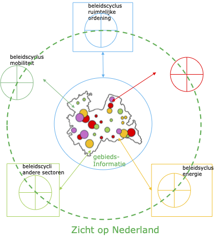

# Globale architectuurbeschrijving

De architectuur van Zicht op Nederland richt zich op het behalen van de belangrijkste doelen die zijn beschreven in de <> en meer specifiek beschreven in het programma Zicht op Nederland:
- **scope:** opbouwen van een gemeenschappelijk ecosysteem voor gebiedsinformatie;
  - passend binnen de nationale en Europese digitale infrastructuur;
  - overeenkomstig nationale en Europse wet-, regelgeving en kaderstelling;

- **schaal:** "van rijk tot wijk";
- **werkprocessen**: alle fasen van de levenscyclus van een gebied (ondersteund door de datawaardeketen);

- **producten:** afspraken, standaarden en voorzieningen ter versterking van de datawaardeketen
  - kennis en data-expertise

De Doelarchitectuur ZoN beschrijft de verbinding tussen de ‘maatschappelijke opgave’ (vraagarticulatie), de uitwisseling van data (datafundament) en data-objecten (rekenmodellen), de aanbieders (basisregistraties, bronhouders) en afnemers (overheden, bedrijfsleven, eenieder, applicaties, digital twins). Dit gebeurt volgens het model van de Datawaardeketen.

Deze verbinding wordt technisch ondersteund, waarbij een aantal principiële, ook niet-technische(!) keuzes worden gemaakt. Deze keuzes staan (per onderwerp) in deze Doelarchitectuur.

De doelarchitectuur beschrijft het ‘gemeenschappelijk ecosysteem’, ingericht volgens de principes van internationale (Europese) ‘dataspaces’. De zo gevormde ‘dataspace van Zicht op Nederland’ noemen we de Dataspace voor de Fysieke Leefomgeving (DSFL), waarin de principiële keuzes worden vertaald naar technische en organisatorische stelselfuncties.

De ‘datagedreven aanpak’ wordt ingevuld door aansluiting (op de architectuur van) Digital Twins en het ZoN-datafundament - die beide ook onderdeel zijn van Zicht op Nederland. 

## Wat regelt DSFL?

DSFL is het ecosysteem waarin gegevens over de fysieke leefomgeving (in brede zin) kunnen worden gecombineerd om te kunnen worden gebruikt tot gebiedsinformatie voor vrijwel elk denkbare opgave, beleidscyclus of operationele cyclus die gaat over de inrichting en het gebruik van de fysieke leefomgeving. 

<figure></img><figcaption>Zicht op Nederland: Beleidscycli en geo-informatie in DSFL</figcaption></figure>

De volgende functionaliteit wordt ondersteund/geleverd:
- geo-data uniform vindbaar en verwijsbaar maken, zodat gebiedsinformatie kan ontstaan uit verschillende gegevensbronnen;
- geo-basisregistraties (‘kern’ uit het Datafundament, zie hiervoor het hoofdstuk 'Data') en wettelijk aangewezen registraties (‘ring 1’) uniform benaderbaar en ‘optelbaar’ maken (‘Stelsel Basisregistraties 2.0’) door middel van duidelijke afspraken over het invullen van (geo-)uitwisselstandaarden (API's) en publiceren van metadata in een daartoe aangewezen voorziening;
- vertalen / benaderbaar maken van geografische data-elementen naar niet-geo gebruikers en andersom (niet-geo data bruikbaar maken voor afbeelding op geografische data, zoals kaarten). Dit vereist waarschijnlijk een nieuwe voorziening die bijvoorbeeld vertalingen van adressen, lokatie-beschrijvingen en verschillende coørdinatenstelsels kan maken;
- reguleren van gebruik op basis van typen gebruikers/deelnemers en ‘gebruikscontracten’. Dit bindt een aantal doelstellingen en principes rondom privacy/security, doelbinding en juridische borging;
- aansluiten (of aan kunnen sluiten) op stelsels in andere domeinen. Dit gebeurt met name door conformeren aan bredere principes en standaarden (FDS, iShare, EU dataspaces);
- een voorziening waarmee dynamisch beelden (kaarten) kunnen worden gegenereerd voor enkele geselecteerde doelgroepen/vraagstukken.

DSFL is de doorontwikkeling van de NGII, in ieder geval die registraties die gegevens bevatten over de fysieke leefomgeving. DSFL kan echter ook gegevens uit andere bronnen ontsluiten en daarnaast ook nog eens naadloos aansluiten op dataspaces van andere domeinen – lokaal, nationaal, internationaal en privaat/publiek. Hierdoor wordt DSFL onderdeel van een groot, universeel bevraagbaar gegevens- en informatielandschap.

De huidige (geo-)Basisregistraties voeren de registraties van fysieke en virtuele objecten (volgens NEN3610 ) van de DSFL/NDFL. Naast deze Basisregistraties bevat de DSFL/NDFL allerlei gegevens over deze/gekoppeld aan gebieden, die niet alleen door de Overheid, maar ook door andere partijen kunnen worden geleverd en beheerd. Onder gegevens verstaan we hier niet alleen klassieke data, maar ook daarvan afgeleide informatie-producten en andere digitale objecten (‘digital assets’ of ‘digital artefacts’), zoals algoritmen die door modellen en Digital Twins kunnen worden uitgewisseld. Zo ontstaat een heterogeen, dynamisch gegevenslandschap dat binnen de vastgestelde regels kan groeien en waarbij de Overheid de rol van ‘primus inter pares’ speelt: zij treedt op als ‘gewone’ speler zowel als Stelselverantwoordelijke.

Databronnen kunnen snel aangesloten worden. Data in die databronnen kunnen direct gevonden en ontsloten worden.  Het maakt niet uit of een databron privaat of publiek is. Als een bron voldoet aan de technische voorwaarden en de voorwaarden van de ‘governance’, kan hij als volwaardige bron meedoen in DSFL/NDFL.

## DSFL in vogelvlucht

DFSL bestaat uit een groot aantal databronnen die allemaal via gestandaardiseerde methoden en technieken gegevens publiceren en ontsluiten voor gebruikers, zoals de huidige voorzieningen in het stelsel Geo-Basisregistraties. Doordat zij hun werkwijze en gebruikte technieken baseren op dezelfde afspraken en standaarden, ontstaan er mogelijkheden om de data te vinden, de kwaliteit te beoordelen, combineren, op dezelfde 'kaart' te projecteren en te leveren aan systemen waarmee grote en brede analyses kunnen worden gedaan, zoals Digital Twins en externe AI modellen. 

Databronnen publiceren hun data (via metadata) in een catalogus, waardoor de data (semantisch) vindbaar is, maar waarin ook aanwijzingen staan over het format, de kwaliteit en enkele andere zaken waarmee het gebruik en de interpretatie van de gegevens worden geholpen. Daarnaast kan er metadata worden vastgelegd over doelbinding, privacy, security, beperkte toegang, kosten en andere voorwaarden voor gebruik. Dit publiceren gebeurt geautomatiseerd, dus de catalogus bevat zelf een API interface voor het onderhoud van deze metadata.

De gebruiker (en dat kan een mens of een organisatie zijn) kan de catalogus bevragen via een door de catalogus aangeboden scherm, waarna er een aantal links worden teruggegeven waarmee de gebruiker verder kan. In het overgrote deel van de gevallen zal de gebruiker echter een applicatie gebruiken met een specifiek doel. Daarom is geautomatiseerde bevraging van de catalogus belangrijk. Hierbij komen zaken als format, coördinatenstelsel, kwaliteit, etc. in het geautomatiseerde antwoord terug en kan direct door de applicatie worden verwerkt. De applicatie van de gebruiker kan dus geautomatiseerd allerlei benodigde bronnen bevragen, de resultaten (laten) vertalen, combineren, berekeningen maken en eventueel ook verbeelden. Voor het vertalen van coördinaten of plaatsaanduidingen biedt DSFL een centrale voorziening. Ook voor het dynamisch verbeelden kan een centrale voorziening worden aangeboden, zeker voor bepaalde doelgroepen en/of bepaalde vraagstukken.

Daar waar nodig of gewenst dienen aanbieders en gebruikers van gegevens en diensten zich te identificeren bij de voorziening die zij willen gebruiken. Zij identificeren zich bij een register dat, na verificatie van de identiteit, een 'token' meegeeft dat aan iedereen doorgegeven kan worden. Dit token bevat geen identificatie, maar is een tijdelijke sleutel van het register dat het uitgegeven heeft. Met deze sleutel kan dan bij datzelfde register de identiteit en andere, voor deze sleutel geautoriseerde gegevens van de partij, gecontroleerd worden. De sleutel heeft een beperkte geldigheid (in tijd, of 'per sessie'). Door dit te standaardiseren op bewezen international (web-)standaarden kan er gebruik gemaakt worden van meerdere identiteitsregisters. Zo kan iedere doelgroep een 'eigen' register hebben. Te denken valt aan DigiD voor Nederlandse burgers, KvK voor Nederlandse bedrijven, etc. Voor sommige doelgroepen moeten deze registers nog gebouwd of aangewezen worden, of wellicht aangepast aan de afgesproken standaarden.

In de DSFL is de basisgedachte dat gegevens en diensten worden geleverd onder een contract of doelbinding. De eenvoudigste versie hiervan is dat er een disclaimer met een gegeven of dienst wordt meegestuurd, meestal in de vorm van een link naar een contract in een contractenregister. Een veel gebruikte term als 'Open data' is zo'n contractvorm. In complexere scenario's kan dit uitgebouwd worden naar gevallen waarin een partij eerst moet bewijzen dat zij een bepaald contract ondertekend heeft voordat de gegevens daadwerkelijk geleverd worden, of dat zij beschikt over een bepaald minimum 'clearance level' voor gevoelige gegevens. De architectuur van DSFL voorziet daartoe in afspraken, standaarden en voorzieningen  die deze autorisatie van partijen regelt.

DSFL stelt eisen aan aanbieders en gebruikers van gegevens en diensten. Zij moeten zich allemaal gedragen volgens een aantal gestandaardiseerde patronen, waarbij gebruik moet worden gemaakt van afgesproken standaarden voor het vraag- en antwoordspel. Dit kan technisch allemaal best ingewikkeld worden voor een aanbieder. Daarom wordt voorzien dat er een universele 'connector' wordt gedefinieerd die deze patronen helpt af te handelen. Het is mooi als gebruik gemaakt kan worden van reeds bestaande of anderszins standaard connectoren. Daarom is de DSFL architectuur zoveel mogelijk geënt op bestaande afspraken en voorzieningen (FDS, EU Dataspaces, W3C web-standaarden).

